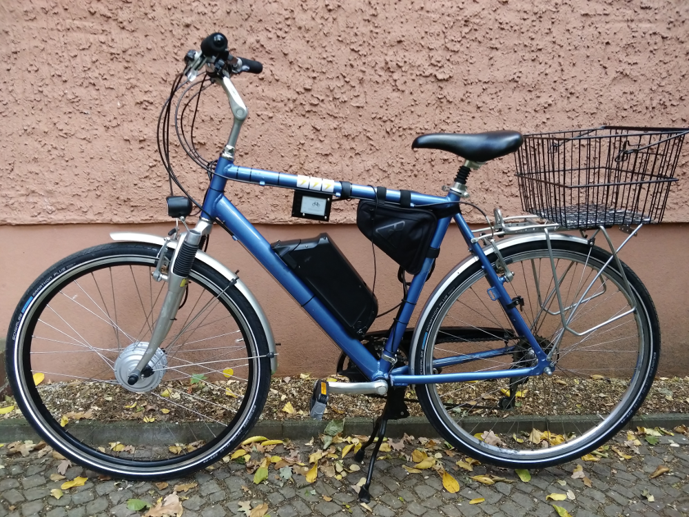
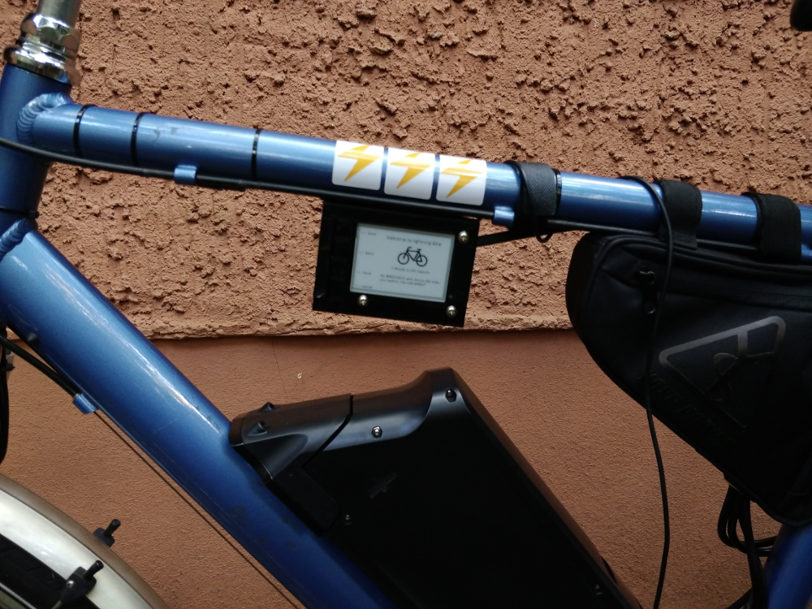
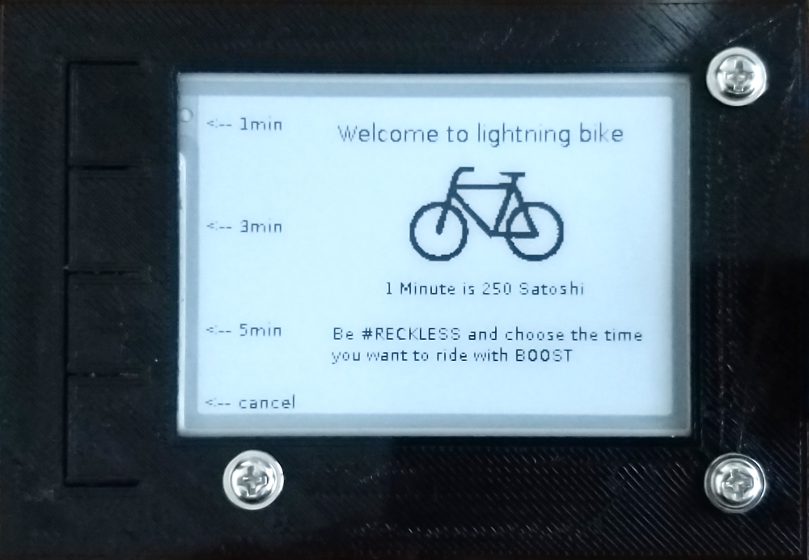
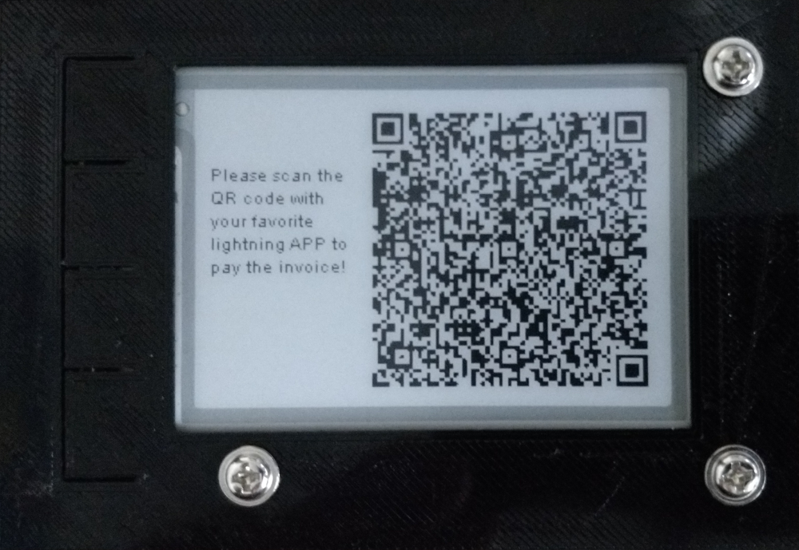
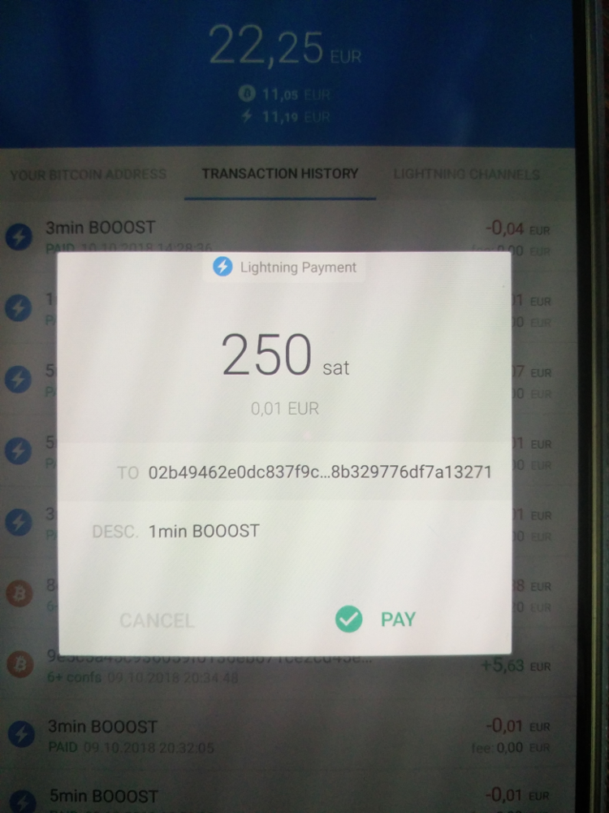
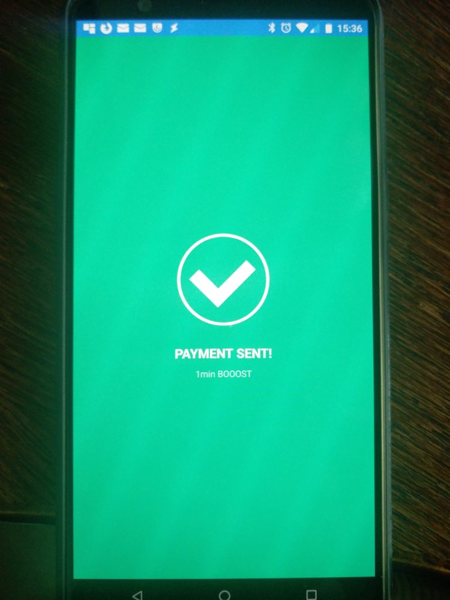
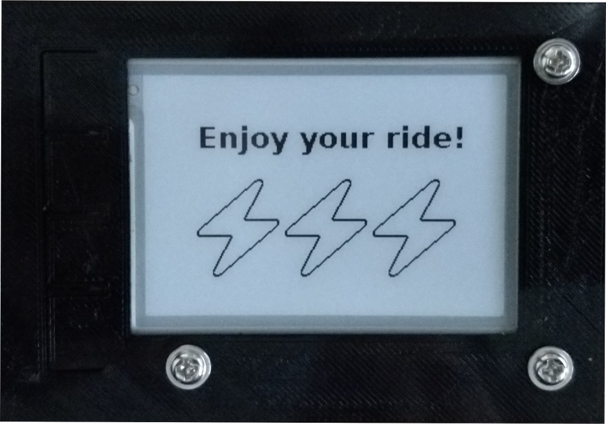

# ⚡lightning⚡ payable e-bike

The lightning-bike is an e-bike (pedelec) whose electrical support can be booked for a certain period of time. 
It uses lightning as a payment system to activate this feature. You select on the display how long you want to drive, 
get a qr-code that you scan and pay for with your lightning mobile APP, after that the power for the selected period is turned on. The special about this system, it's mobile, the communication is realized via the mobile network and the power comes from the 
battery of the e-bike.

## How does it work?

The client automatically establishes a connection to the Internet with the USB network card after booting. The program starts and
the display shows the start screen where you can currently choose between three different times of use. 250 satoshi are required per minute.

The customer selects the period and the program generates a payment request, which is transmitted by lightning-charge to the node of the server. The client gets the payment information back from the server and uses it to generate a qr-code which is shown to the customer on the display. The customer now has 60 seconds to scan and pay for the qr-code with his lightning mobile APP. As long as the client tests at the server if the bill is reported as paid.

Once the payment has been made, the system will power on for the selected time and you can start driving !!! After the end of the paid time, the system switches off and the power supply is interrupted - of course you can continue driving, but only with muscle power. The program returns to the home screen and you can book new time again.
If it did not work, the start screen will be displayed and you can try it again.

## System setup:

The heart of the system is a Raspberry Pi Zero WH, which controls both the connection to the mobile network and the switching 
of the power supply via a relay. An e-paper display is used as a monitor, which practically also provides 4 switches for the 
control of the programm. I mainly used the e-paper display because it consumes very little power, actually only when the screen 
changes, the contrast and good readability even on sunny days. The image composition is quite long with about 6 seconds, but it 
will be require only 2 steps/images to complete the payment process.

On the server side there is a Raspberry Pi 3 B there runs a lightning node based on c-lightning https://github.com/ElementsProject/lightning. This installation differs only in that there is no Bitcoin fullnode installed. I use the pseudonode sPRUNED https://github.com/gdassori/spruned/ which has the advantage that I only need about 300MB for the bitcoin blockchain. This step is optional and not required, but I wanted to learn more about the stability of sPRUNED. If you do not already run a bitcoin fullnode, you should start with this, it will run a bit more stable and strengthen bitcoin network at the same time! For the lightning node control i use the lightning-charge API https://github.com/ElementsProject/lightning-charge. That was the main reason for me to choose the c-lightning implementation. With lightning-charge it was very easy to programm the payment processes.

On the client side, i choice a raspberry Pi Zero WH with an e-paper display, mainly to keep power consumption as low as possible. More problematic in power consumption is certainly the USB modem/network card, there is perhaps a better way. The relay 
for switching the power for the system is controlled via GPIO and also the 4 switches of the e-paper queried via GPIO.

### components server:
- Raspberry Pi 3B
- 16GB microSD card
- Standard RPi case
- microUSB cable
- Power adapter
- network cable

### components client:
- Raspberry Pi Zero WH
- 16GB microSD card
- Waveshare 2.7inch E-Ink display 264x176 px
- Huawei Technologies Co., Ltd. USB modem / network card
  (prepaid from Tchibo - funny but maybe only in germany :-) (provider network O2)
- 1 channel relay 5V / 230V
- microUSB cable
- Cable, solder, hot glue, assembly tape etc.
- Self-designed case made of PLA https://www.thingiverse.com/thing:3160072

## The bike:

A normal 28 inches men's bike with derailleur system, what I converted into a e-bike with a conversion kit from the company 
YOSE Power (Ebay). The conversion kit includes a 250W front engine witch complies with the legal requirements, so it can be used
in normal road traffic. The conversion, that's a story for itself!
